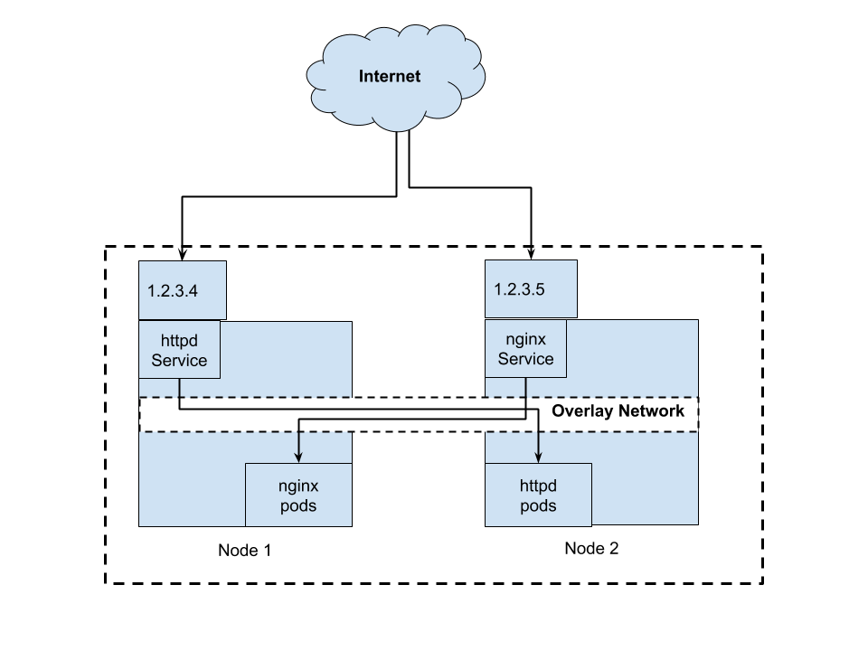
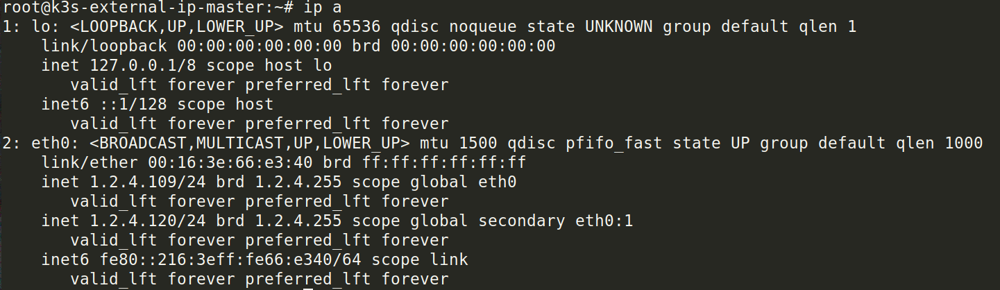
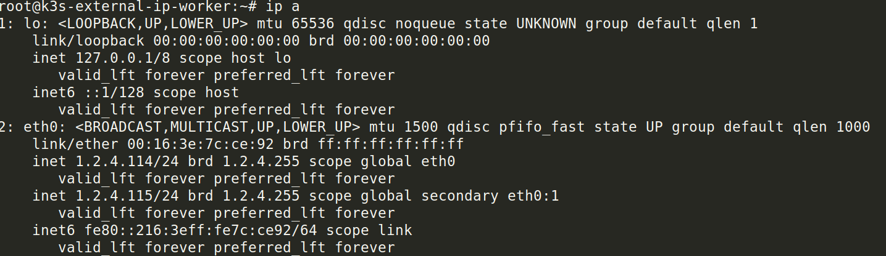
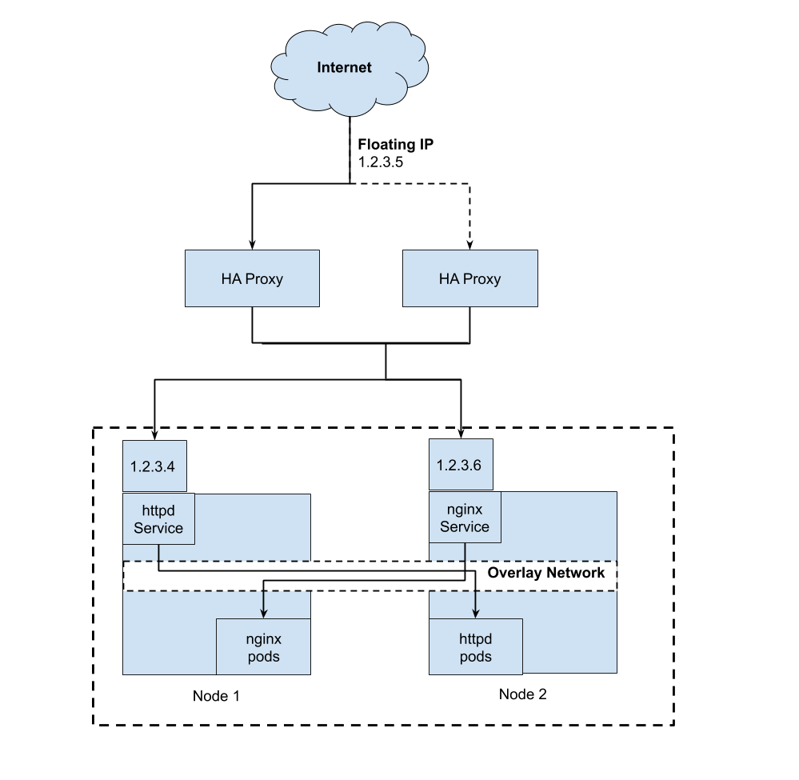
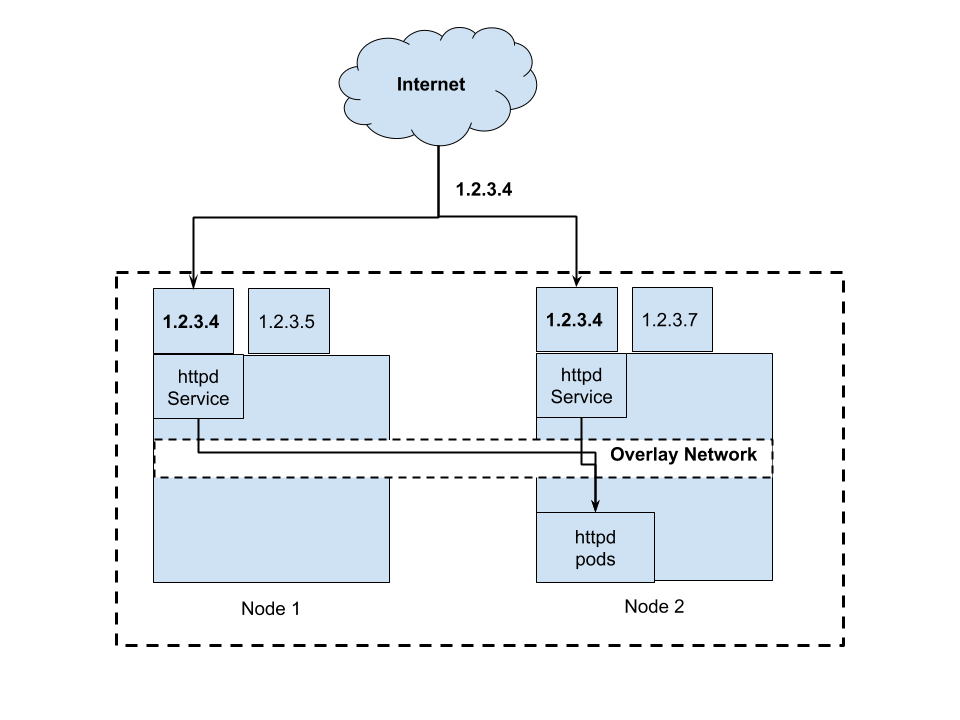

When building a baremetal Kubernetes cluster, you might face a common problem  as I do where you don't really know how to expose your Kubernetes service to the Internet other than using NodePort. If you are using NodePort service type, it will assign a high port number to be opened and you have to allow your firewall rule to connect to those ports. That is not good for your infrastructure especially when you're exposing the server to the outside Internet. Well, there is another neat way to expose your  Kubernetes service to the world and you can use its original port number. For example, you can expose MySQL service that reside in your Kubernetes cluster to the outside world on port 3306 rather than port 32767. The answer is using Kubernetes External IP service type.

Personally, I find that this topic not widely discussed among Kubernetes community, probably because many are using cloud providers' Load Balancer or use Metal LB for on-prem deployments.

## What is External IP Service 
From [official Kubernetes](https://kubernetes.io/docs/concepts/services-networking/service/#publishing-services-service-types) documentation, this is how External IP is described
> If there are external IPs that route to one or more cluster nodes, Kubernetes Services can be exposed on those  `externalIPs`. Traffic that ingresses into the cluster with the external IP (as destination IP), on the Service port, will be routed to one of the Service endpoints.  `externalIPs`  are not managed by Kubernetes and are the responsibility of the cluster administrator.

The explanation is understandable for most people. The most important thing here is to be sure which IP is used to reach the Kubernetes cluster. Using external IP service type, we can *bind* the service to the IP used to connect to the cluster.

It is good if you briefly know how Kubernetes networking works. If you are not familiar with it, do check out this [blog post](https://medium.com/google-cloud/understanding-kubernetes-networking-pods-7117dd28727) written by Mark Betz to understand them in detail. The most important this to know here is that the Kubernetes network works with Overlay network. This means that once you reach any of the nodes (master or worker node) in the cluster, you can virtually reach the everything in the cluster.

This is how they're illustrated


In the diagram above, both Node 1 and Node 2 has 2 IP addresses. The IP address 1.2.3.4 on Node 1 is bind to httpd service where the actual pod reside in Node 2 and the IP address 1.2.3.6 is bind to nginx service in that the actual pod reside in Node 1. The underlying Overlay network makes this possible.

## Why not use Ingress?
Even though Ingress is used to expose service to outside, Ingress is built for L7 routing. This means it built to support HTTP (port 80) and/or HTTPS (port 443) traffic and not for other ports. Ingress works as host based routing or similar to virtual host in Web Server world. Some ingress controllers able to serve other ports or may provides workaround for L4 routing but I have never actually experiment with them.

## Advantages & Disadvantages of External IP
The advantage of using External IP are:
- You have full control towards the IP that you announce.

The disadvantage of External IP are:
- The simple setup that we will go thru right now is **NOT** highly available. That means if the node dies, the service is no longer reachable and you'll need to manually remediate the issue.
- There are some manual work needs to be done to manage the IPs. The IPs are not dynamically provisioned for you thus it require human intervention.

## How to use External IP service
### Our setup
Again, we will use the same diagram as our reference for our cluster setup, except with different IP and different hostname. This is not a good real life example, but it's easy to distinguish which is which when we're verifying the setup. In real life example, you might want to expose MySQL DB on 1 external IP and Kafka cluster on another external IP.

### Step 1: Setup Kubernetes cluster
We will setup a 2 nodes Kubernetes cluster using Rancher's k3s. It will take 5 minutes to have this running. We will setup the cluster using k3sup.

I have provisioned 2 VMs for this demo on Onapp cloud.




*\* Note that most cloud providers does not allow your VM to have more than 1 IP attached to your VM. Onapp cloud allows this.*

Lets install k3s on the master node and let another node to join the cluster.
```
$ k3sup install --ip <master node ip> --user <username>
$ k3sup join --server-ip <master node ip> --ip <worker node ip> --user <username>
```

You should be seeing something like this now
```
$ kubectl get nodes
NAME                                 STATUS   ROLES    AGE     VERSION
k3s-external-ip-master.localdomain   Ready    master   7m24s   v1.16.3-k3s.2
k3s-external-ip-worker               Ready    <none>   2m21s   v1.16.3-k3s.2
```

### Step 2: Create Kubernetes deployments
We will create nginx deployment and httpd deployment.
```
$ kubectl create deployment nginx --image=nginx
$ kubectl create deployment httpd --image=httpd
```

You should be seeing this now
```
$ kubectl get pods
NAME                     READY   STATUS    RESTARTS   AGE
nginx-86c57db685-fzxn5   1/1     Running   0          22s
httpd-7bddd4bd85-zk8ks   1/1     Running   0          16s
```

### Step 3: Expose the deployments as External IP type
Lets expose the nginx deployment and httpd deployment on External IP.
```
$ cat << EOF > nginx-service.yaml
apiVersion: v1
kind: Service
metadata:
  name: nginx-service
spec:
  selector:
    app: nginx
  ports:
    - name: http
      protocol: TCP
      port: 80
      targetPort: 80
  externalIPs:
    - 1.2.4.114
EOF
```
And expose httpd deployment
```
$ cat << EOF > httpd-service.yaml
apiVersion: v1
kind: Service
metadata:
  name: httpd-service
spec:
  selector:
    app: httpd
  ports:
    - name: http
      protocol: TCP
      port: 80
      targetPort: 80
  externalIPs:
    - 1.2.4.120
EOF
```

Kubectl them
```
$ kubectl create -f nginx-service.yaml
$ kubectl create -f httpd-service.yaml
```

Now your Kubernetes services should look like this
```
$ kubectl get svc
NAME            TYPE        CLUSTER-IP      EXTERNAL-IP   PORT(S)   AGE
kubernetes      ClusterIP   10.43.0.1       <none>        443/TCP   18m
httpd-service   ClusterIP   10.43.240.149   1.2.4.120     80/TCP    32s
nginx-service   ClusterIP   10.43.13.149    1.2.4.114     80/TCP    26s
```

### Step 4: Voila!
Lets curl the httpd service and you should see the Apache default page response.
```
$ curl -i 1.2.4.120
HTTP/1.1 200 OK
Date: Fri, 20 Dec 2019 03:36:23 GMT
Server: Apache/2.4.41 (Unix) <------
Last-Modified: Mon, 11 Jun 2007 18:53:14 GMT
ETag: "2d-432a5e4a73a80"
Accept-Ranges: bytes
Content-Length: 45
Content-Type: text/html

<html><body><h1>It works!</h1></body></html>
```

Next, lets curl nginx service and you should see nginx default page response.
```
$ curl -i 1.2.4.114
HTTP/1.1 200 OK
Server: nginx/1.17.6 <------
Date: Fri, 20 Dec 2019 03:36:01 GMT
Content-Type: text/html
Content-Length: 612
Last-Modified: Tue, 19 Nov 2019 12:50:08 GMT
Connection: keep-alive
ETag: "5dd3e500-264"
Accept-Ranges: bytes

<!DOCTYPE html>
<html>
<head>
<title>Welcome to nginx!</title>
....
```

## What's next
### HA Proxy & Keepalived
Im not really sure if this works. I will do a POC later and write another blog post on this. Conceptually this is how it looks like.



[https://www.digitalocean.com/community/tutorials/how-to-set-up-highly-available-haproxy-servers-with-keepalived-and-floating-ips-on-ubuntu-14-04](https://www.digitalocean.com/community/tutorials/how-to-set-up-highly-available-haproxy-servers-with-keepalived-and-floating-ips-on-ubuntu-14-04)

Note that Digital Ocean doesn't supports Floating IP for worker nodes in its Kubernetes platform. Refer [here](https://www.digitalocean.com/docs/networking/floating-ips/).

You can also use Cloud Load Balancer available out there and set the target IP to the on-prem worker nodes. You can get Cloud Load Balancer from Linode, DigitalOcean, etc.

### Anycast IP


You could use Anycast IP as External IP so that they are highly available. For those who are not familiar with Anycast IP, it means that 1 IP may be routed to 2 or more servers. You can read more [here](https://en.wikipedia.org/wiki/Anycast). Personally, I am not really sure how to setup this. However, technically, it is viable. I think this is the best way to run External IP service.

## Conclusion
There are many options that you can get a IP for bare metal Kubernetes cluster. For example, you can use Inlets and Metal LB for that purpose. This setup might not be the best suit your organization needs. However, it is good to know how you can use this approach.

### Disclaimer
I only use this for experimentation and testing and this article is not meant for production use. Please consult your solution architect or CTO if you're planning to use this in production.
