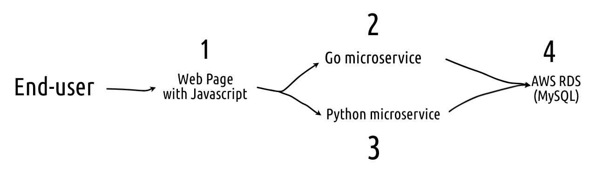

## Overview
During my weekends, I have actively developing a web app called Trip Planner. However, it is still in alpha stage and far from stable release.

## How it started
The story began when my wife and I  were planning to go for a vacation in Korea in October 2019. We were planning our itineraries using Google Doc, listing all the point of interests, hotel bookings, financial budget there. After few moments, I told her that maybe I could build a web app to assist us.

I am now preparing to take AWS Sysops Administrator certification. However, I do not have much opportunity in my daily job working with AWS platform. I have to start my own project to learn the platform.

## Objectives
Trip Planner users should be able to:
- Create, Read, Update, Delete trip and itineraries
- Share trip with friends with a neat permalink

Because I am learning AWS, I want to:
- Use as much AWS services as possible
- Simulate as much scenarios in AWS as possible eg disaster recovery, database failover, server failure (chaos engineering)
- Use microservice architecture
- Write in Go and Python
- Not to emphasize on front end, lets use jQuery for simplicity
- Try not to cross the free-tier limit (I am now charged for $0.50 per month)

I have a dream to launch this service in the future as a real service, God Wills

## Architecture

This web app will be built using [JAMstack](https://jamstack.org/) architecture. I choose this stack because
- I have a fairly good understanding of CDN service (because I work with this everyday!)
- I can work on backend code without worrying about the front end part. They are all decoupled.
- Serving website from Object Storage and CDN is super cheap compare to serving from EC2 instances. I am a cheapskate!

Basically, this is how the system architecture looks like.
 - **Component 1 - Web Page with Javascript**  
 The front end comprised of HTML, CSS and JS files. The Javascript will invoke API calls to backend services for operations. These static assets is served using AWS S3 and AWS Cloudfront.
 - **Component 2 - Go microservice**   
I am writing User management microservice using Go. I used Echo framework to serve the requests and GORM to interact with database. The service is served using Nginx reverse proxy on AWS EC2 instance.
-  **Component 3 - Python microservice**   
I am using Python Flask to serve all requests other than user management system. The service is served using Nginx reverse proxy on AWS EC2 instance. The service is managed by systemd on Ubuntu Linux.
-  **Component 4 - AWS RDS**   
I used AWS RDS to host the database. I am using MySQL because that is what I am comfortable the most.

All code are hosting in Github private repository and synced to target server. I know, I will work on the CI/CD pipeline to automate this deployment process.

## Current progress: Nov 2019
It is still in early stage but it is serving the requests. I will continue to update in this blog.

	fadhil@trip-planner:/var/log/nginx$ tail -f access.log
	xxx.xxx.xxx.xx - - [18/Nov/2019:15:08:01 +0000] "GET /api/trips_latlong/1 HTTP/1.1" 200 228 "http://xxxx.s3-website.us-east-2.amazonaws.com/trip.html?trip_id=1" "Mozilla/5.0 (X11; Linux x86_64) AppleWebKit/537.36 (KHTML, like Gecko) Chrome/74.0.3729.131 Safari/537.36"