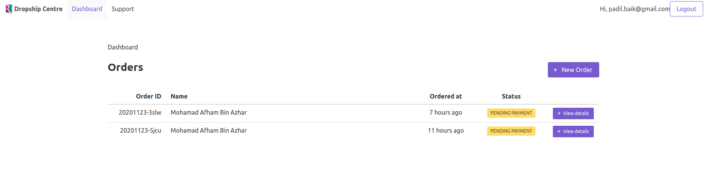
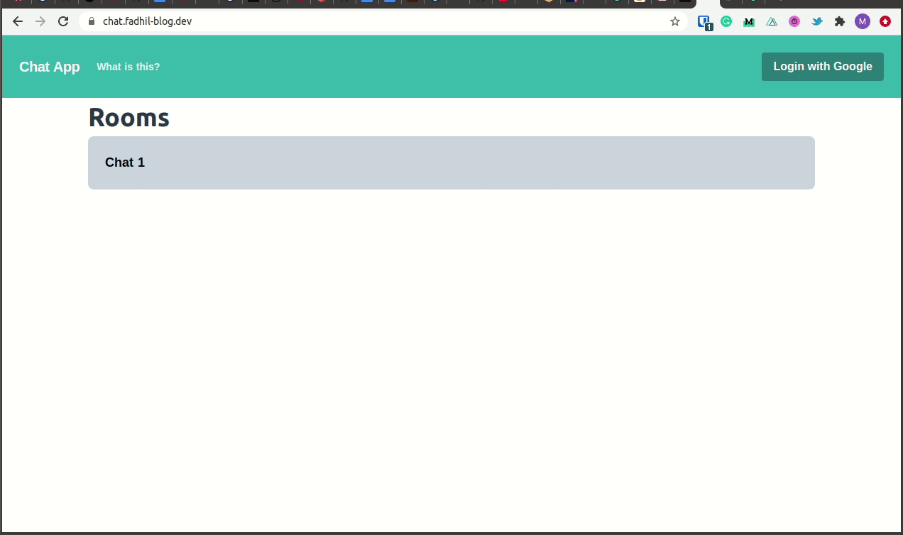
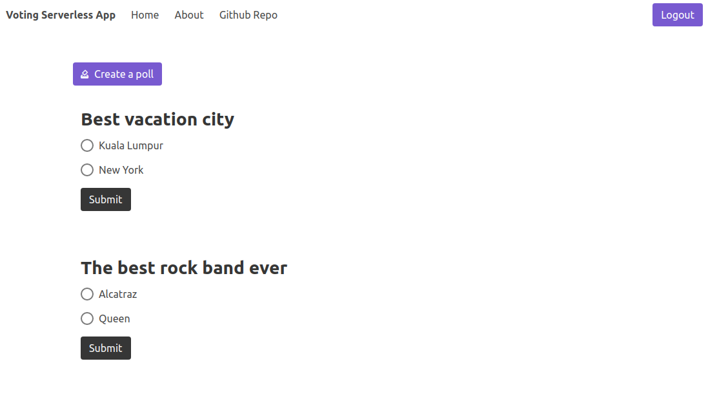

These are the list of weekend projects I did for fun and learning.

## Commercial Projects

### Raudhah Ilmi Dropship Centre - Nov 2020

This is a special project built for my lovely wife's bookshop.

**Objective**: Dropship agents to be able to calculate shipping price, submit orders and track orders easily, even from a mobile phone.

**Technologies used**: Django Rest Framework, PostgreSQL, Linode VM, AWS S3, Google Oauth2 social login, Netlify, Nuxt Auth, Nuxt PWA.

I'll be working and launching more commercial projects/startups in 2021. Stay tuned ;)

## Open Source Projects

These are my open source projects published on Github.

### Chat App - Oct 2020

Visit the project [here](https://chat.fadhil-blog.dev). See the source code [here](https://github.com/sdil/graphql-chat). See me building this project in this [Twitter thread](https://twitter.com/sdil/status/1306045334414479360).

**Objective**: Learning to build **GraphQL** project and **accept payment** by building a simple chat app, in public.

**Technologies Used**: Hasura, Websocket, PostgreSQL, Docker, Firebase Auth, Stripe, NuxtJS + Apollo

### Hasura Firebase Auth Webhook - Sep 2020

Visit the project & source code [here](https://github.com/sdil/hasura-firebase-auth-webhook). See me building this project in this [Twitter thread](https://twitter.com/sdil/status/1309432290930380801).

**Objective**: While building a [GraphQL Chat App](#chat-app---wip), I'm integrating my Hasura GraphQL engine with Firebase Auth. This webhook will secure the GraphQL endpoints with Firebase Auth.

**Technologies Used**: Go, Docker (with multi-stage build), Github Actions & Github Container Registry.

### Voting Serverless - Aug 2020

Visit the project [here](https://vote.fadhil-blog.dev). See the source code [here](https://github.com/sdil/voting-serverless-cdk). See me building this project in this [Twitter thread](https://twitter.com/sdil/status/1284816892301959168).

**Objective**: Learning **Serverless technology** by building a simple scalable voting app, in public.

**Technologies Used**: AWS CDK, DynamoDB, DynamoDB Streams, SQS, Lambda, API Gateway (HTTP API), S3, Cloudfront, ACM, X-Ray, Cognito User Pools, NuxtJS

### Yet Another Free Instagram Clone (YAFIG) - WIP

Visit the project [here](https://yafig.netlify.app). See the source code [here](https://github.com/yafig/api-server-monolith).

**Objective**: Learning to build **production-ready REST API** using Django REST Framework (monolith) by building a simple Instagram clone, in public.

**Technologies Used**: Django, Django REST Framework, PostgreSQL, Docker, Elasticsearch, Redis, Celery, Sentry, AWS S3, Netlify, NuxtJS.

### Other Projects

I've made minor contributions on many open source projects, mostly related to Kubernetes. You can visit them in my [Github profile](https://github.com/sdil?tab=repositories).
